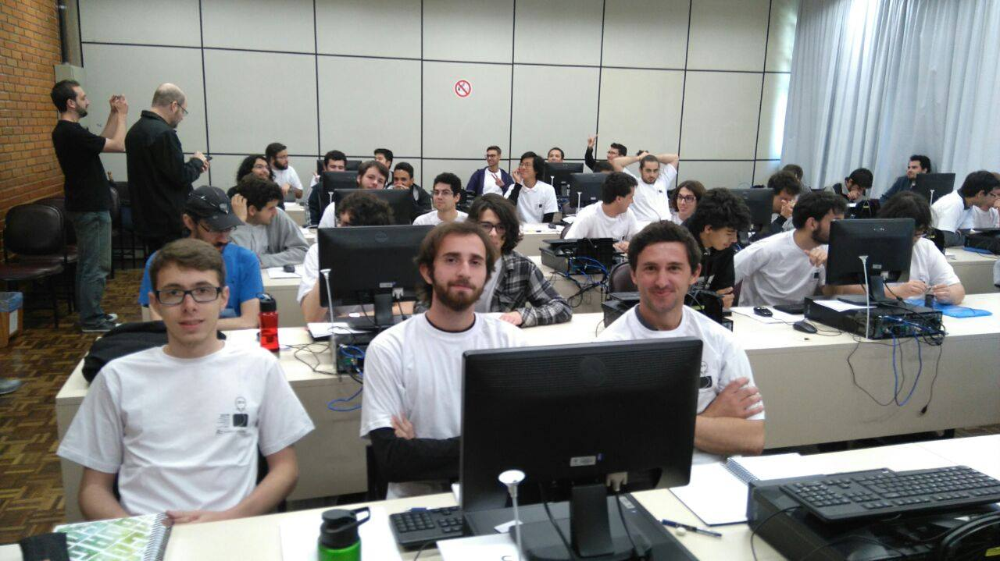

Com um time novo, neste sábado participei da competição mais acirrada que já vi.

Eu, Edimar Bauer e Murilo Henrique lutamos pela única vaga cedida à sede de Curitiba, no Paraná, e por 23 minutos de diferença na penalidade de tempo ficamos em segundo lugar.

Murilo Henrique, Cristhian Bonilha e Edimar Bauer

Meus parabéns ao time NomeProvisorioTrypanossoMestre, da UFPR, que levou o primeiro lugar na nossa sede 🙂

Ficamos em 37° lugar no Brasil, e estamos torcendo para levar a vaga decidida pelo misterioso critério do Comitê Diretor da Maratona. Vou atualizar esse post quando eles tomarem a decisão.

Update 15/09: Foi divulgada a lista com os 60 finalistas, e conseguimos uma vaga para a segunda fase por estarmos entre os “3 melhores times de instituições não representadas” 😀

No mais é isso, obrigado e até mais.
