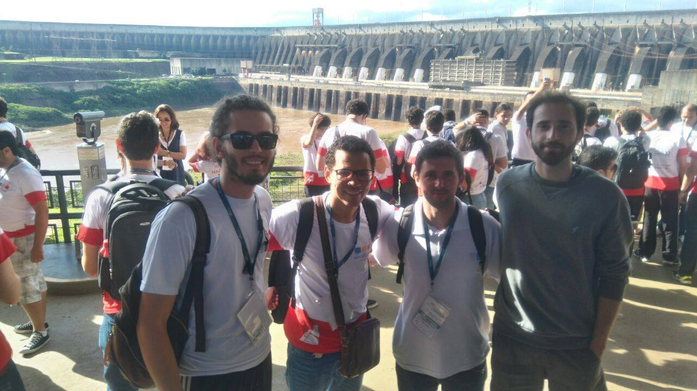

Com uma nova formação, a equipe BugBusters, pelo terceiro ano seguido, conquistou uma vaga para a fase brasileira da Maratona de Programação \o/

Gabriel Teixeira, Saulo Queiroz, Edimar Bauer, Cristhian Bonilha

Resolvemos um total de 8 exercícios. Como de costume, deixamos alguns erros tolos nos impedir de resolver mais exercícios, mas isso faz parte :/

Eu sei que o post tá atrasado, mas é tradição falar disso aqui no blog, então “antes tarde do que nunca”.

Dia 10 de novembro estaremos em Foz do Iguaçu. Nos vemos lá!
