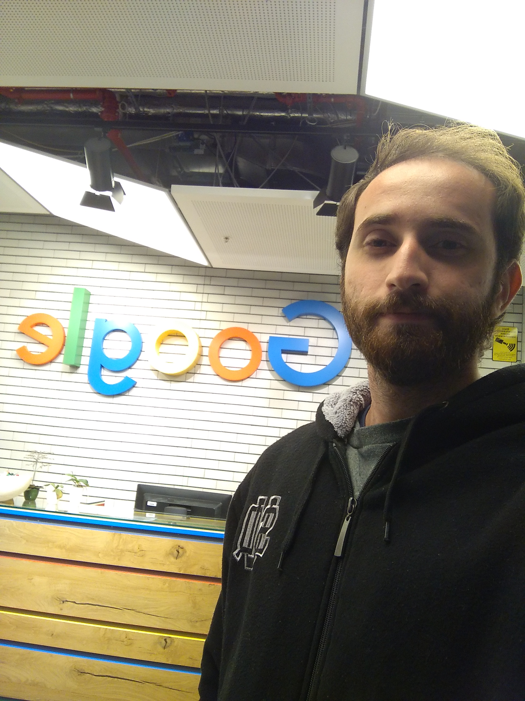

Olá programadores. Depois de muito tempo sem atualizar este blog, eu resolvi escrever sobre uma conquista que
há muito tempo eu sonhava: fui contratado como Software Engineer na Google 🙂

O escritório no qual eu estou trabalhando fica em Munique, na Alemanha. Faz pouco mais de um mês que estou aqui,
e minhas primeiras impressões tem sido as melhores possíveis. As pessoas aqui em Munique são muito educadas,
mesmo diante de um brasileiro perdido que, além de não falar sequer duas palavras em alemão, tem um inglês bem
meia-boca. Meanwhile, no escritório todos falam inglês, e têm sido muito pacientes comigo ao me ensinar o “modo
Googler de ser”, que vai desde boas práticas de desenvolvimento até dicas de como interagir com pessoas de diferentes
nacionalidades/culturas.

Chegar aqui não foi uma tarefa fácil. A Google é uma das maiores empresas de tecnologia do mundo, e eles buscam
contratar pessoas muito bem “capacitadas”. Essa “capacitação” é uma coisa difícil de mensurar, e cada empresa
no planeta tem sua definição (im)perfeita de candidato ideal. A definição da Google, pela experiência que eu tive,
é a de que o programador deve ter um vasto conhecimento teórico de ciência da computação e uma habilidade de
analisar/”resolver” problemas computacionais.

Na minha jornada de programador eu já explorei diversas áreas que me interessavam, cada qual contribuindo de forma
diferente com o meu currículo. A área que teve maior influência em quem eu sou hoje foi a maratona de programação,
pois isso me forçou a estudar dezenas e dezenas de estruturas de dados e algoritmos clássicos, além de desenvolver
uma habilidade de abstração e análise de problemas de computação.

## Processo de seleção

Pra quem tiver interesse, eu vou falar brevemente sobre como foi o processo de seleção para mim.

O primeiro passo foi me inscrever. Basta acessar o site https://careers.google.com, explorar as diversas vagas
disponíveis, e escolher aquela que mais lhe interessar.

Uma semana depois, pra minha surpresa, um recrutador se interessou pelo meu perfil e entrou em contato comigo.
Após trocar alguns e-mails, marcamos uma entrevista online para que eu pudesse tirar minhas dúvidas sobre como é
trabalhar na Google, o que seria esperado de mim na vaga que eu apliquei , como é o processo de seleção, etc.

Em seguida, marcamos minha primeira entrevista técnica. Esta entrevista também foi online, e nela eu tive que
resolver um problema de computação usando o Google Docs (assim o entrevistador podia ver, em tempo real, o código
que eu estava escrevendo). O objetivo era avaliar a minha habilidade de abstrair o problema, analisá-lo, apresentar
possíveis soluções, ponderar sobre seus trade-offs, e rascunhar uma das soluções na linguagem de programação que eu escolhesse.

Felizmente eu passei nesta entrevista, e em breve fui convidado para visitar o escritório em Belo Horizonte,
onde eu faria mais cinco entrevistas técnicas, no mesmo formato citado acima, porém desta vez cara a cara com
o entrevistador (usando um pedaço de papel no lugar do Google Docs). Todos os custos da viagem e hospedagem
foram pagos pela Google, diga-se de passagem.

Após algumas ansiosas semanas, recebi a confirmação de que eu havia sido aprovado. Só me restava agora escolher
em qual projeto/escritório eu trabalharia. Depois de avaliar as opções, escolhi a Alemanha.

Comemorei, comecei a correr atrás do visto e, três meses depois, aqui estava eu xD

Bom, é isso. Quem tiver dúvidas sobre como é trabalhar na Google, ou sobre como é o processo de seleção em mais
detalhes, basta deixar um comentário abaixo ou entrar em contato comigo por e-mail ou redes sociais. Até mais 🙂
