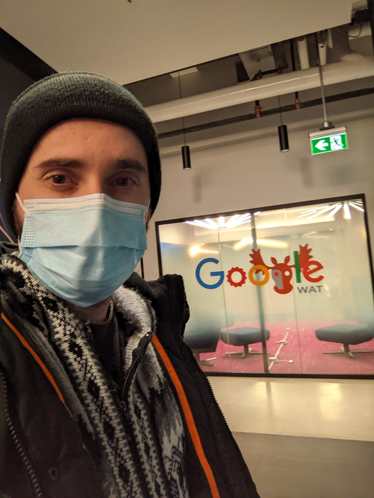

Olá programadores.

Já faz um bom tempo que eu não apareço por aqui, não é mesmo? Meu último update pessoal foi em 2019,
quando eu acabava de ser contratado na Google no escritório em Munique, na Alemanha. Depois de três
anos, decidi que aquele não era o lugar para mim, e pedi transferência para o escritório em Kitchener-Waterloo, no Canadá.

E cá estou eu. Muita coisa aconteceu, muita coisa mudou, mas minha paixão por maratonas de programação
(ou “programação esportiva”, termo o qual uma parte da comunidade está começando a usar) continua viva.

No restante deste post eu vou dar um resumo das minhas contribuições mais marcantes envolvendo a maratona
nesse período que não postei aqui no blog, incluindo os seguintes itens: meu trabalho de 20% no Kick Start,
meu problema na prova regional da maratona de 2020, e meus problemas na prova subregional da maratona de 2021.
Clica aí pra ver mais!

## Kick Start

Quando eu entrei na Google eu tive o prazer de conhecer muitos ex-competidores. É impressionante quanta
gente lá tem um histórico competitivo bem sucedido, tal como finalistas mundiais da ICPC, rating de grande
mestre no Codeforces, e por aí vai.

O interesse de alguns destes ex-competidores não acaba quando entram no mercado de trabalho, e muitos deles
acabam se voluntariando para produzir mais competições para a comunidade. Foi assim que surgiu o Kick Start,
que é uma competição organizada por voluntários da Google e que acontece (quase) mensalmente.

A minha relação com o Kick Start é a oportunidade de 20% que a Google oferece. Todo funcionário da Google
(salvo algumas exceções) tem direito a se voluntariar a dedicar 20% do seu tempo de trabalho para algum projeto
que ache interessante. Sabendo disso, eu me voluntariei para ajudar a montar alguns exercícios do Kick Start.

Já fazem dois anos que estou contribuindo, e esse ano não vai ser diferente.

## Maratona da SBC/ICPC – 2020

No ano de 2020 eu tive a honra de ser o autor de um dos problemas da prova regional da maratona de programação
organizada pela SBC/ICPC.

O problema se chama Keylogger, e vocês podem resolver ele na plataforma [Neps Academy](https://neps.academy/exercise/1578).
Vocês podem ver mais detalhes sobre a prova em si na [página da maratona](http://maratona.sbc.org.br/hist/2020/resfinal20.html).

Depois da prova rolou uma live com os autores e organizadores, onde eu falei um pouco sobre como resolver esse
problema. Vocês podem conferir minha explicação acessando a [live](https://www.youtube.com/watch?v=rc0YWBqmr-E&ab_channel=MaratonaSBC)
e assistindo a partir dos 50 minutos.
Vale lembrar que eu aconselho que vocês tentem ao máximo resolver o exercício sozinho antes de ver a solução.
Vale lembrar também que eu sou péssimo falando em vídeo, então minha explicação talvez não seja das melhores 🙂

## Maratona da SBC/ICPC – 2021

Satisfeito com o ano anterior, decidi me voluntariar mais uma vez para colaborar com a prova em 2021. Desta
vez eu tive a honra de ter dois de meus exercícios escolhidos para a fase subregional.

Os problemas se chamam Escada Rolante e Monarquia em Vertigem, e eu ainda não sei onde vocês podem resolver
eles online. Vocês podem ver mais detalhes sobre a prova na [página da maratona](http://maratona.sbc.org.br/primfase21.html).

Semelhante à prova de 2020, após a prova de 2021 também rolou uma live com os autores, mas desta vez eu não
pude participar pois estava ocupado em processo de mudança. Felizmente os outros autores se voluntariaram para
falar dos meus exercícios, e vocês podem ver as explicações acessando a
[live](https://www.youtube.com/watch?v=wYdb8YWd87Q&ab_channel=MaratonaSBC), e assistindo a partir dos 11
minutos para o problema Escada Rolante, e a partir das 2 horas e 6 minutos para o problema Monarquia em Vertigem.
Novamente, aconselho que tentem resolver antes de ver a solução.

Eu to me organizando pra comparecer presencialmente na fase regional em Gramado, em março. Espero ver vocês lá!

## Notas finais

Vocês talvez tenham notado que o blog mudou de layout. Eu tive que atualizar a versão do php dele, e pra isso eu
tive que iniciar uma nova máquina na nuvem e mover todo o conteúdo do blog da máquina antiga pra nova. Ao fazer isso
eu perdi algumas configurações, mas eu to me ajeitando aos poucos.

Eu tenho mais coisas pra contar, mas eu vou acabar esse post por aqui senão eu fico sem conteúdo para os próximos posts.
Espero que eu consiga ser um pouco mais organizado a partir de agora e que eu possa atualizar o blog com mais frequência,
e quem sabe até com algum conteúdo que seja educativo. Sugestões são bem vindas.

Obrigado a todos que leram até aqui, e bons estudos!
